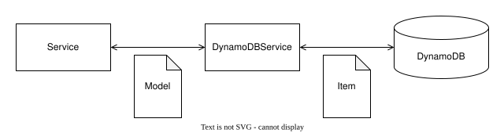
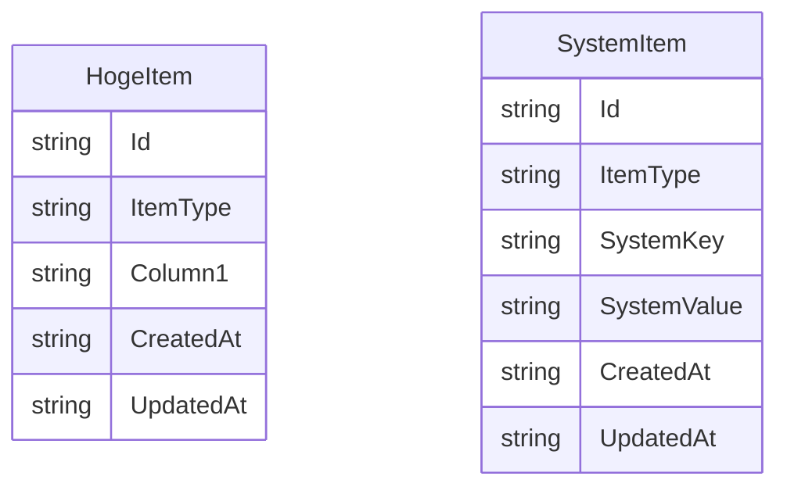
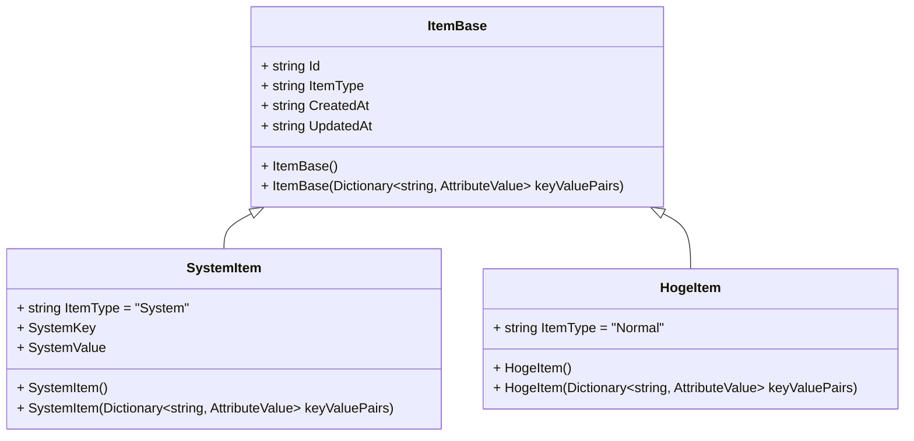

# DynamoDB

- DynamoDB の扱いについて記述する。

## 構成



- 各 Service から直接 DynamoDB にアクセスするのではなく、DynamoDBService を経由します。これにより、データアクセスの一元管理が可能になります。

- DynamoDBService は DynamoDB のテーブルごとに作成する

- DynamoDBService と DynamoDB のやり取りは Item のクラスを使用し、各 Service と DynamoDBService のやり取りは Model のクラスを使用します。

### DynamoDB

#### セカンダリインデックス
- **インデックス名**: `ServiceIndex`
    - **パーティションキー**: `ID`
    - **目的**: NormalレコードをIDで効率的に取得するため。

- **インデックス名**: `DataIndex`
    - **パーティションキー**: `Key`
    - **目的**: Systemレコードをキーでフィルタリングするため。

- DynamoDBの特性を活かし、複数のDBを作成するのではなく、1つのDBに異なる特徴のレコードを格納します。これにより、データの管理が容易になり、ビューを作成することで、異なるデータを効率的に表示できます。また、データの一貫性を保ちながら、柔軟なクエリが可能になります。



- 各レコードは HogeItem に格納する

    - ItemType は `Normal`

- SystemItem は全テーブルに作成する

    - ItemType は `System`

    - 必須となるレコードは下記

        - Key: Counter

            - HogeItem の Id を管理するためのキー

            - DynamoDBはオートインクリメント機能を持たないため、`Counter`アイテムを使用してIDを管理します。これにより、各アイテムのIDを一意に生成することができ、データの整合性を保つことができます。

### Item



### DynamoDBService

```mermaid
classDiagram
class DynamoDBServiceBase {
    <<Abstract>>
    # string TableName
    - AmazonDynamoDBClient client
    + DynamoDBServiceBase(IConfiguration configuration)
    + Task~T~ GetItem~T~(Guid id)
    + Task<(List~T~, Guid?)> GetItems~T~(Dictionary~string, string~ expressions, Guid? startId)
    + Task~Guid~ AddItem~T~(T Item)
    + Task UpdateItem~T~(Guid id, T Item)
    + Task DeleteItem(Guid id)
}

class HogeDBService {
    # string = "Hoge"
}

DynamoDBServiceBase <|-- HogeDBService
