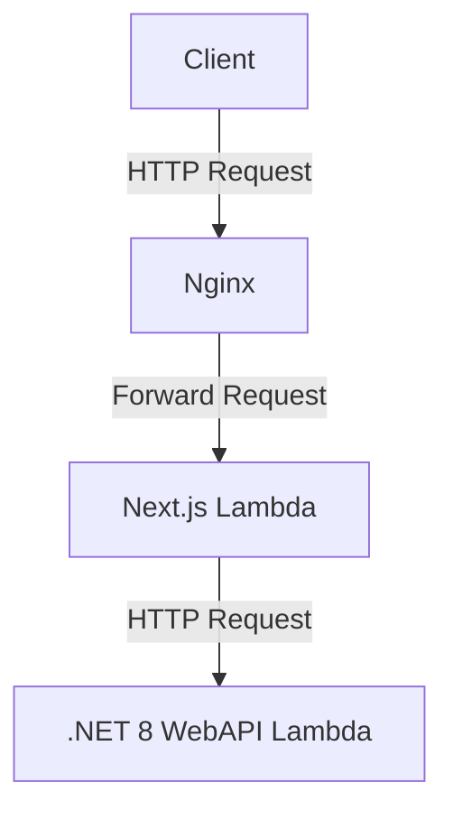

# プロジェクト名: Nagiyu Web サービス

## 1. 概要
このプロジェクトは、Next.js を使用した SSR アプリケーションと、.NET 8 の WebAPI を AWS Lambda 上で実行し、Nginx をリバースプロキシとして使用する構成です。

## 2. 要件

### 2.1 機能要件
- **Next.js アプリケーション**
  - SSR によるページレンダリング
  - ユーザー認証機能
  - API との連携

- **.NET 8 WebAPI**
  - RESTful API の提供
  - データベースとの接続
  - 認証機能の実装

### 2.2 非機能要件
- **パフォーマンス**
  - レスポンスタイムの最適化
  - スケーラビリティの確保

- **セキュリティ**
  - HTTPS の導入
  - 認証と認可の実装

## 3. 設計

### 3.1 アーキテクチャ
- クライアントからのリクエストは Nginx に送信され、Nginx が Next.js Lambda 関数にリクエストを転送します。

### 3.2 コンポーネント図

## 4. 開発環境
- **言語**: JavaScript (Next.js), C# (.NET 8)
- **フレームワーク**: Next.js, ASP.NET Core
- **デプロイ先**: AWS Lambda
- **リバースプロキシ**: Nginx
