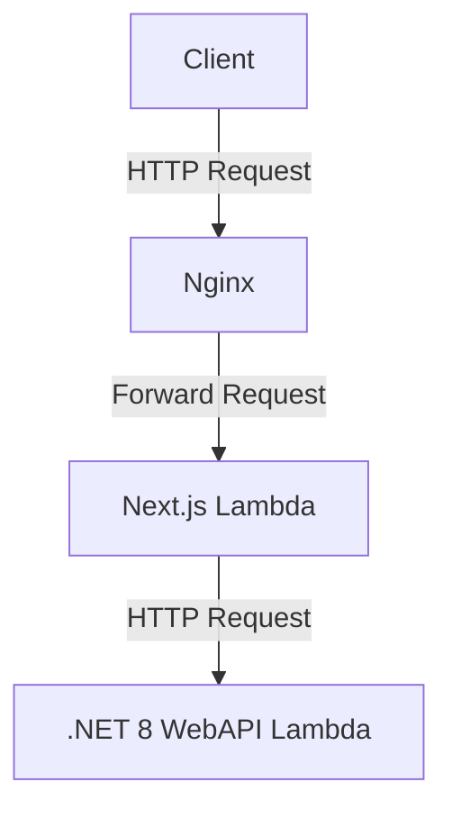

# プロジェクト名: Nagiyutil

## 1. 概要
このプロジェクトは、Next.js を使用した SSR アプリケーションと、.NET 8 の WebAPI を AWS Lambda 上で実行し、Nginx をリバースプロキシとして使用する構成です。

## 2. 要件

### 2.1 機能要件
- **Next.js アプリケーション**
  - SSR によるページレンダリング
  - ユーザー認証機能
  - API との連携

- **.NET 8 WebAPI**
  - RESTful API の提供
  - データベースとの接続
  - 認証機能の実装

### 2.2 非機能要件
- **パフォーマンス**
  - レスポンスタイムの最適化
  - スケーラビリティの確保

- **セキュリティ**
  - HTTPS の導入
  - 認証と認可の実装

## 3. 設計

### 3.1 アーキテクチャ
- クライアントからのリクエストは Nginx に送信され、Nginx が Next.js Lambda 関数にリクエストを転送します。

### 3.2 コンポーネント図


## 4. 開発環境
- **言語**: JavaScript (Next.js), C# (.NET 8)
- **フレームワーク**: Next.js, ASP.NET Core
- **デプロイ先**: AWS Lambda
- **リバースプロキシ**: Nginx

## 5. プロジェクト構成
このプロジェクトは、複数のサービスを持つアプリケーションであり、以下のように構成されています。

```
/Nagiyutil
│
├── /service1              # サービス1のプロジェクト
│   ├── /client             # クライアントサイドのコード
│   │   ├── /components     # 再利用可能なコンポーネント
│   │   ├── /pages          # ページコンポーネント
│   │   ├── /public         # 静的ファイル
│   │   ├── /styles         # スタイルシート
│   │   └── /utils          # ユーティリティ関数
│   └── /server             # サーバーサイドのコード
│       ├── /Controllers    # API コントローラー
│       ├── /Models         # データモデル
│       ├── /Services       # ビジネスロジック
│       ├── /Data           # データベース接続
│       └── /Middlewares    # ミドルウェア
│
├── /service2              # サービス2のプロジェクト
│   ├── /client             # クライアントサイドのコード
│   │   ├── /components     # 再利用可能なコンポーネント
│   │   ├── /pages          # ページコンポーネント
│   │   ├── /public         # 静的ファイル
│   │   ├── /styles         # スタイルシート
│   │   └── /utils          # ユーティリティ関数
│   └── /server             # サーバーサイドのコード
│       ├── /Controllers    # API コントローラー
│       ├── /Models         # データモデル
│       ├── /Services       # ビジネスロジック
│       ├── /Data           # データベース接続
│       └── /Middlewares    # ミドルウェア
│
├── /common                # 共通のコードやライブラリ
│   ├── /components         # 共通コンポーネント
│   ├── /utils              # 共通ユーティリティ関数
│   └── /services           # 共通サービス
│
├── /nginx                 # Nginx 設定
│   ├── default.conf        # Nginx のデフォルト設定
│   └── ssl.conf            # SSL 設定
│
├── /docker                 # Docker 設定
│   └── docker-compose.yml   # 開発環境用の Docker Compose 設定
│
└── /.github                # GitHub Actions 設定
    ├── workflows           # ワークフロー設定
    │   ├── deploy_dev.yml  # 開発環境用のデプロイワークフロー
    │   └── deploy_prod.yml # 本番環境用のデプロイワークフロー
```

### 構成のポイント
1. **サービスごとの独立性**: 各サービスは独立したプロジェクトとして管理され、クライアントサイドとサーバーサイドのコードが分かれています。
2. **共通コードの管理**: `common` フォルダには、クライアントサイドとサーバーサイドの両方で使用される共通のコードを配置します。
3. **明確な役割分担**: 各サービス内での役割が明確に分かれているため、開発や保守が容易になります。
4. **Nginx 設定**: Nginx の設定ファイルを専用のフォルダにまとめ、開発環境での設定を行います。
5. **Docker 設定**: 開発環境用の Docker 設定を配置し、AWS Lambda でのデプロイを考慮します。
6. **GitHub Actions 設定**: 開発環境用と本番環境用のデプロイ設定を分けて管理します。
